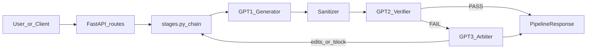

# Epistemic Verification Pipeline — analysis (what / why / how / for whom)

This document is a codebase-grounded view of the service: what it is, why it exists, how it runs, and who uses it. It is written partly in **first person** as if the pipeline were describing itself.

---

## First person: “If I were this program”

I am a **FastAPI service** ([app.py](../app.py)) whose job is to take a user’s natural-language question, produce an answer with an LLM, then **audit that answer for epistemic integrity** before I show it. I do not trust a single model pass. I treat the generator as creative and the verifier as skeptical. When the verifier says the text fails my rules, I may call a third model to **arbitrate**—block, rewrite with edits, or force “unknown-only” framing. I can optionally **search the web** (Tavily) when routing flags say the topic is time-sensitive or evidence-hungry. I attach **confidence reasoning**, a **claim table**, and sometimes **search sources** so humans and downstream systems know *why* I trust or distrust the output.

---

## What (identity and surface area)

- **Name / version**: “Epistemic Verification Pipeline” v3.0.0 in [app.py](../app.py); prompt framework **Audit v7** at `PROMPT_VERSION = "7.1.0"` in [pipeline/prompts.py](../pipeline/prompts.py).
- **Core contract**: `POST /api/pipeline` accepts [PipelineRequest](../pipeline/models.py) (`prompt`, optional `tier`, `output_format`, `stream`) and returns [PipelineResponse](../pipeline/models.py): generator output, verifier JSON artifacts, optional arbiter path, `final_verdict` (`PASS` / `FAIL`), `final_result`, `confidence`, `claim_table`, violations/findings metadata, search fields.
- **Supporting surfaces**: `GET /` embedded UI ([api/ui.py](../api/ui.py) via [api/routes.py](../api/routes.py)), `GET /health`, config endpoints for OpenAI/Tavily/per-stage models, `POST /api/stress` for batch stress testing ([pipeline/stress.py](../pipeline/stress.py)), rate limiting ([api/rate_limit.py](../api/rate_limit.py)), optional feedback storage ([pipeline/feedback.py](../pipeline/feedback.py)), and a separately authenticated private folder-grounded lane at `POST /api/grounded/documents/{document_id}` and `POST /api/grounded/query`.

---

## Why (problem and design intent)

Documented explicitly in [README.md](../README.md) and encoded in prompts:

- **Problem**: LLMs hallucinate and overstate—fabricated stats, causal claims as fact, prescriptive creep, “current” facts from training cutoff. Content filters do not fix *epistemic* failure modes.
- **Intent**: Insert a **verification layer** between generation and the user: Generator (GPT-1) → Verifier (GPT-2) → Arbiter (GPT-3) when needed.
- **Normative framework**: Audit v7 — priority stack **V1–V7**, global rules **G1–G12**, tripwires **T1–T7** (see header comment and `DEFAULT_GPT1_SYSTEM` in [pipeline/prompts.py](../pipeline/prompts.py)). The generator is instructed to structure output (Observed / Inferences / Unknown / …); the verifier checks structured JSON including claim table and findings.

---

## How (execution path — async path is default for the API)

The live async orchestrator is `run_pipeline_async` in [pipeline/orchestrator.py](../pipeline/orchestrator.py), which runs a **linear stage list** from [pipeline/stages.py](../pipeline/stages.py). Each stage mutates shared state and may set `early_return` with a finished `PipelineResponse`.

**Ordered stages** (from orchestrator comments):

1. **Init** — API key / metrics / stage configs.
2. **Route** — `route_prompt()` in [pipeline/sanitizer.py](../pipeline/sanitizer.py): deterministic flags (e.g. legal, current events, advice).
3. **Search** — `should_search` / `perform_web_search` in [pipeline/search.py](../pipeline/search.py) when flags warrant; builds context for GPT-1 and evidence for later steps.
4. **Build prompts** — `build_augmentation()` in [pipeline/prompts.py](../pipeline/prompts.py) adjusts all three system prompts from flags; date context from `_date_context()` in [pipeline/orchestrator.py](../pipeline/orchestrator.py).
5. **Generate** — GPT-1 (multi-provider via [pipeline/helpers.py](../pipeline/helpers.py)); optional best-of-N ([pipeline/best_of_n.py](../pipeline/best_of_n.py)).
6. **Fast paths** — e.g. activation-pattern bypass (`is_activation_phrase`), current-events messaging without search (`_fail_message()` in [pipeline/orchestrator.py](../pipeline/orchestrator.py)).
7. **Sanitize** — `sanitize_output()` strips or tags risky patterns citation-aware.
8. **Decompose** — atomic claims ([pipeline/decomposer.py](../pipeline/decomposer.py)).
9. **NLI** — optional grounding ([pipeline/nli.py](../pipeline/nli.py)).
10. **Verify** — GPT-2 with **tripwire reference injected at top of user content** (`GPT2_TRIPWIRE_REFERENCE` + task block in `_verify_text` in [pipeline/stages.py](../pipeline/stages.py)); structured parse when possible (`parse_gpt2_structured` / `GPT2ResponseSchema`). Source-aware recategorization ([pipeline/source_match.py](../pipeline/source_match.py)).
11. **Soft retry** — if failures are soft-only, repair and re-verify ([pipeline/verifier.py](../pipeline/verifier.py) `_all_soft`, `recompute_verdict`).
12. **Arbiter** — on persistent FAIL: GPT-3 parses to BLOCK / ALLOW_WITH_EDITS / ALLOW_AS_UNKNOWN_ONLY ([pipeline/arbiter.py](../pipeline/arbiter.py)).
13. **Rewrite loop** — apply edits (`apply_edits` / `apply_edits_by_id`), re-verify; **convergence guard** ([pipeline/convergence.py](../pipeline/convergence.py)); cap aligned with `MAX_REWRITE_LOOPS` (see [CLAUDE.md](../CLAUDE.md)). Possible fallback regen path in sync orchestrator for stuck cases.

**Confidence**: `compute_confidence()` in [pipeline/orchestrator.py](../pipeline/orchestrator.py) blends claim categories, weighted T1–T7 penalties, optional search authority scores, and NLI grounding.

### Separate folder-grounded execution path

Private user-owned knowledge does not pass through the legacy Audit-v7/search
chain. [knowledge_store.py](../pipeline/knowledge_store.py) versions UTF-8 source
bytes and materializes one deterministic SQLite FTS5 evidence packet.
[grounded_rag.py](../pipeline/grounded_rag.py) then runs a claim-first answerer,
a blind per-claim verifier, and an always-invoked constrained final adjudicator.
Python permits only doubly cited `SUPPORTED` claim IDs and renders the final
answer; missing evidence or any reference/hash/protocol failure abstains. See
[grounded-folder-rag.md](grounded-folder-rag.md) for its exact contract and
deployment boundary.

---

## For whom (stakeholders)

| Audience | How they interact |
|----------|-------------------|
| **End users** | Browser UI at `/` for chat-style verification. |
| **Integrators / apps** | `POST /api/pipeline` (JSON or NDJSON `stream: true`); authenticated `/api/grounded/*` endpoints for one fixed private corpus; n8n templates under [n8n-workflows/](../n8n-workflows/). |
| **Operators** | Env-based config ([config.py](../config.py), `.env.example`), Railway/Docker deploy ([CLAUDE.md](../CLAUDE.md)); runtime key/model toggles via API. |
| **Developers / QA** | Deterministic unit tests under [tests/](../tests/); stress harness via `/api/stress` and [tests.json](../tests.json). |

---

## Operational character (how the program “feels” under load)

- **Concurrency**: Shared `AsyncOpenAI` client with key-rotation safety in [app.py](../app.py); async LLM calls in stages.
- **Safety / abuse**: Per-IP rate limit; `base_url` allowlist for custom providers to reduce SSRF risk ([api/routes.py](../api/routes.py)); optional CORS from `ALLOWED_ORIGINS`; private grounded routes fail closed unless `KNOWLEDGE_API_TOKEN` is configured.
- **Observability**: `PipelineMetrics` / `record_run` in orchestrator and stages.

---

## Files to read next (deeper dives)

- Full tripwire reference: `GPT2_TRIPWIRE_REFERENCE` and verifier parsing rules in [pipeline/prompts.py](../pipeline/prompts.py) + [pipeline/verifier.py](../pipeline/verifier.py).
- Exact PASS/FAIL/BLOCK branching: `stage_verify`, `stage_soft_retry`, `stage_arbiter`, `stage_rewrite_loop` in [pipeline/stages.py](../pipeline/stages.py).
- Folder-backed evidence and release invariants: [knowledge_store.py](../pipeline/knowledge_store.py), [grounded_rag.py](../pipeline/grounded_rag.py), and [grounded-folder-rag.md](grounded-folder-rag.md).
